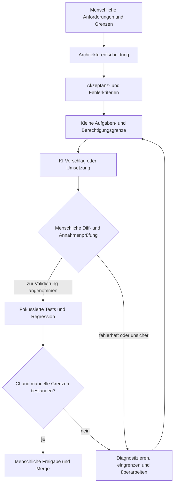

# KI-unterstützter Entwicklungsablauf

Dieses Diagramm zeigt den kontrollierten, menschlich gesteuerten Ablauf für KI-unterstütztes Engineering.

## Lesart des Diagramms

- Menschliche Anforderungen und Architektur gehen der KI-Umsetzung voraus.
- KI erhält eine begrenzte Aufgabe und einen begrenzten Berechtigungsumfang.
- Vollständiger Diff und Annahmen werden vor der Validierung geprüft.
- Tests und CI liefern unabhängige Nachweise.
- Fehler führen zurück zur Diagnose und einer engeren Aufgabe.
- Finale Freigabe und Merge bleiben menschliche Aktionen.

## Verwandte Dokumentation

- [KI-unterstützter Entwicklungsablauf](../docs/12-ai-development-workflow.de.md)
- [CI/CD-Pipeline](../docs/09-ci-cd-pipeline.de.md)
- [Teststrategie](../docs/10-testing-strategy.de.md)
- [Roadmap](../docs/13-roadmap.de.md)
