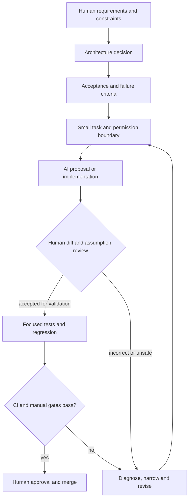

# AI-Assisted Development Workflow

This diagram shows the controlled human-led workflow used for AI-assisted engineering.

## Reading the Diagram

- Human requirements and architecture precede AI implementation.
- AI receives a bounded task and permission scope.
- The complete diff and assumptions are reviewed before validation.
- Tests and CI provide independent evidence.
- Failure returns to diagnosis and a narrower task.
- Final approval and merge remain human actions.

## Related Documentation

- [AI-Assisted Development Workflow](../docs/12-ai-development-workflow.md)
- [CI/CD Pipeline](../docs/09-ci-cd-pipeline.md)
- [Testing Strategy](../docs/10-testing-strategy.md)
- [Roadmap](../docs/13-roadmap.md)
