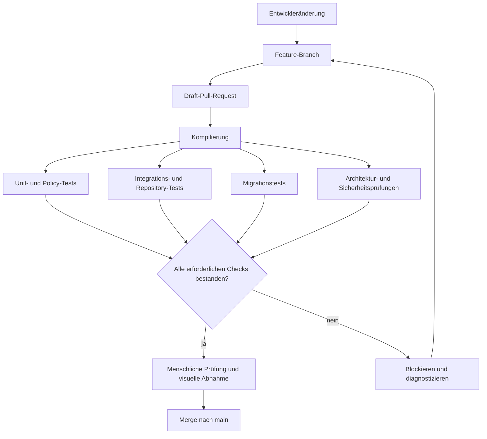

# CI-Pipeline

Dieses Diagramm zeigt die konzeptionelle Pull-Request-Qualitätsgrenze von MerchantFlow. Produktive Workflow-Definitionen, Zugangsdaten und Artefaktziele bleiben privat.

## Lesart des Diagramms

- Ein Pull Request bleibt prüfbar, während unabhängige Qualitätsstufen ausgeführt werden.
- Kompilierungs-, Unit-, Integrations-, Migrations- und Architekturnachweise laufen in einer Qualitätsgrenze zusammen.
- Fehlgeschlagene erforderliche Checks blockieren die Integration und liefern Diagnosen an den Branch zurück.
- Automatisierter Erfolg ersetzt keine menschliche Architektur-, Datenschutz- und visuelle Prüfung.
- Release-Autorisierung ist ein getrennter Prozess nach der Integration.

## Verwandte Dokumentation

- [CI/CD-Pipeline](../docs/09-ci-cd-pipeline.de.md)
- [Technologiestack](../docs/02-technology-stack.de.md)
- [Veröffentlichungsgrenzen](../PUBLICATION-SCOPE.de.md)
