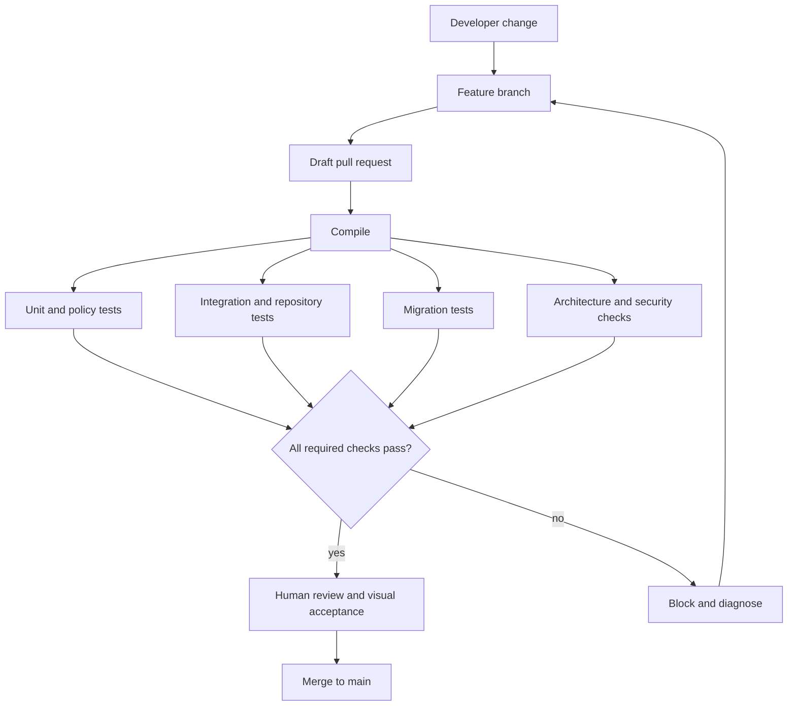

# CI Pipeline

This diagram shows the conceptual pull-request quality gate for MerchantFlow. Production workflow definitions, credentials, and artifact destinations remain private.

## Reading the Diagram

- A pull request remains reviewable while independent quality stages execute.
- Compile, unit, integration, migration, and architecture evidence converge on one gate.
- Failed required checks block integration and return diagnostics to the branch.
- Automated success does not replace human architecture, privacy, and visual review.
- Release authorization is a separate process after integration.

## Related Documentation

- [CI/CD Pipeline](../docs/09-ci-cd-pipeline.md)
- [Technology Stack](../docs/02-technology-stack.md)
- [Publication Scope](../PUBLICATION-SCOPE.md)
