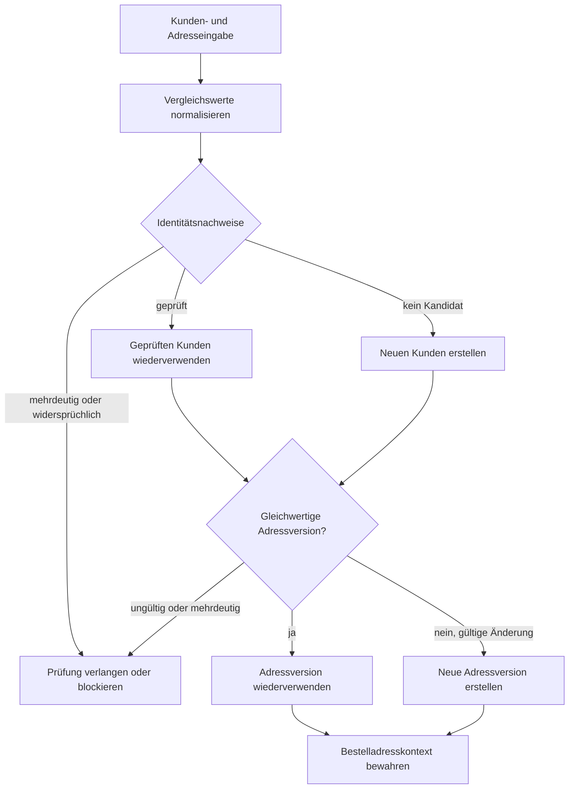

# Ablauf der Kunden- und Adresszuordnung

Dieses Diagramm zeigt, wie Kundennachweise und Adressversionen aufgelöst werden, bevor eine Bestellung ihren historischen Adresskontext erhält.

## Lesart des Diagramms

- Normalisierung unterstützt den Vergleich, entscheidet aber nicht über Identität.
- Ein geprüfter Kunde kann wiederverwendet werden; ohne Kandidaten ist kontrollierte Neuerstellung möglich.
- Mehrdeutige Nachweise verändern keinen vorhandenen Kunden.
- Gleichwertige Adressen können eine Version wiederverwenden; gültige Änderungen erzeugen eine neue Version.
- Die Bestellung bewahrt nach der Auflösung ihren eigenen Rechnungs- und Lieferkontext.

## Verwandte Dokumentation

- [Kunden- und Adressversionierung](../docs/07-customer-address-versioning.de.md)
- [Bestellablauf](../docs/06-order-workflow.de.md)
- [Konzeptionelles Domänenmodell](domain-model.de.md)
