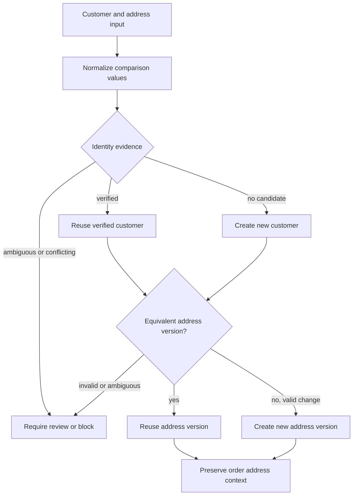

# Customer and Address Resolution Flow

This diagram shows how customer evidence and address versions are resolved before an order receives its historical address context.

## Reading the Diagram

- Normalization supports comparison but does not decide identity.
- A verified customer can be reused; no candidate can lead to controlled creation.
- Ambiguous evidence does not modify an existing customer.
- Equivalent addresses can reuse a version; valid changes create a new version.
- The order preserves its own billing and shipping context after resolution.

## Related Documentation

- [Customer and Address Versioning](../docs/07-customer-address-versioning.md)
- [Order Workflow](../docs/06-order-workflow.md)
- [Conceptual Domain Model](domain-model.md)
