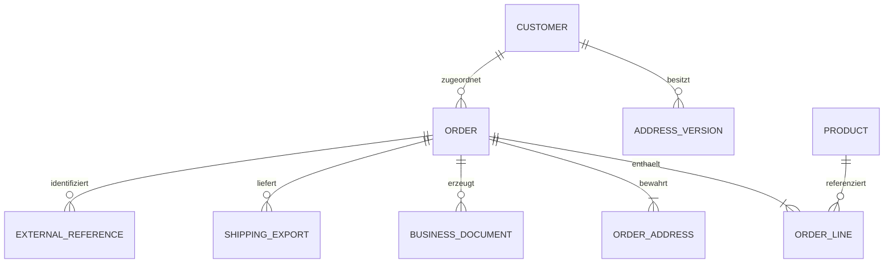

# Konzeptionelles Domänenmodell

Dieses Mermaid-Diagramm zeigt die wichtigsten Verantwortungs- und Nachvollziehbarkeitsbeziehungen im öffentlichen MerchantFlow-Modell. Es ist bewusst kein produktives Entity-Relationship-Schema.

## Lesart des Diagramms

- Ein Kunde kann mehrere Adressversionen besitzen.
- Eine Bestellung besitzt ihre Positionen und Transaktionsadressen.
- Produktstammdaten können von vielen Bestellpositionen referenziert werden, während akzeptierte Positionswerte historische Transaktionsdaten bleiben.
- Dokumente, Versandausgaben und externe Referenzen bleiben der Bestellung zugeordnet.
- Das Diagramm zeigt konzeptionelle Verantwortung und keine Tabellen, Spalten, Cascade-Regeln oder die vollständige private Domäne.

## Verwandte Dokumentation

- [Domänenmodell](../docs/04-domain-model.de.md)
- [Datenbankdesign](../docs/05-database-design.de.md)
- [Systemarchitektur](../docs/03-system-architecture.de.md)
