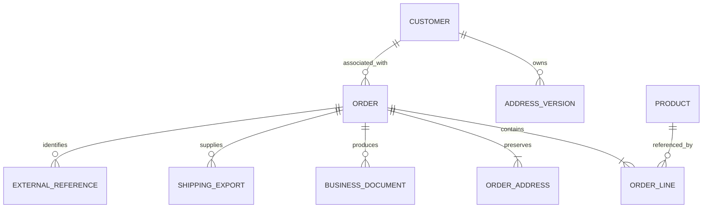

# Conceptual Domain Model

This Mermaid diagram shows the principal ownership and traceability relationships in the public MerchantFlow model. It is intentionally not a production entity-relationship schema.

## Reading the Diagram

- A customer can own several address versions.
- An order owns its lines and transaction-address records.
- Product master data can be referenced by many order lines, while accepted line values remain historical transaction data.
- Documents, shipping output, and external references remain attributable to the order.
- The diagram shows conceptual ownership, not table names, columns, cascade rules, or the complete private domain.

## Related Documentation

- [Domain Model](../docs/04-domain-model.md)
- [Database Design](../docs/05-database-design.md)
- [System Architecture](../docs/03-system-architecture.md)
