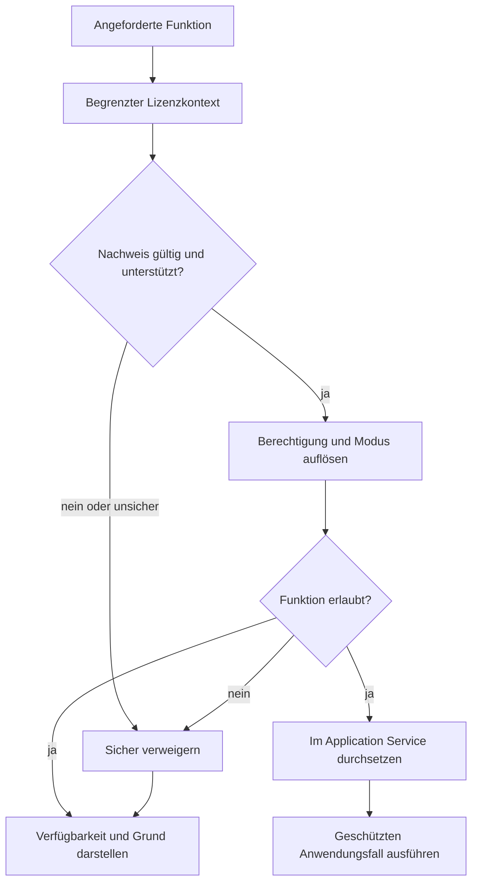

# Lizenzbewertung

Dieses Diagramm zeigt die öffentliche Funktionsbewertungsgrenze. Lizenzformate, kryptografische Details, Schlüssel, Gerätebindung und Umgehungsschutz werden bewusst ausgelassen.

## Lesart des Diagramms

- Rohe Lizenznachweise werden nur hinter der zentralen Grenze interpretiert.
- Ungültiger oder unsicherer geschützter Zustand führt zur Verweigerung.
- UI-Verfügbarkeit und Service-Autorisierung verwenden dieselbe Funktionsentscheidung.
- Ein sichtbares oder aktiviertes Control ersetzt keine Service-Durchsetzung.
- Nach der Lizenzautorisierung gilt weiterhin die Domänenvalidierung.

## Verwandte Dokumentation

- [Lizenzarchitektur](../docs/08-license-architecture.de.md)
- [Systemarchitektur](../docs/03-system-architecture.de.md)
- [CI/CD-Pipeline](../docs/09-ci-cd-pipeline.de.md)
