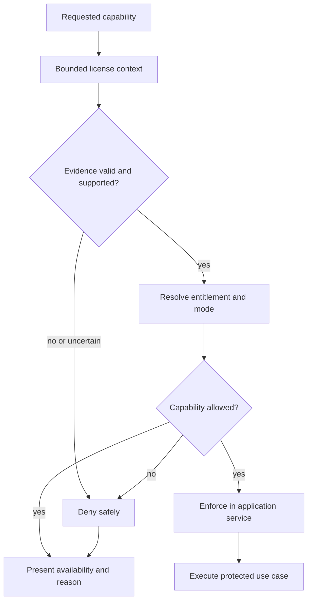

# License Evaluation

This diagram shows the public capability-evaluation boundary. It intentionally omits license formats, cryptographic details, keys, machine binding, and bypass protections.

## Reading the Diagram

- Raw license evidence is interpreted only behind the central boundary.
- Invalid or uncertain protected state results in denial.
- UI availability and service authorization use the same capability decision.
- A visible or enabled control does not replace service enforcement.
- Domain validation still applies after license authorization.

## Related Documentation

- [License Architecture](../docs/08-license-architecture.md)
- [System Architecture](../docs/03-system-architecture.md)
- [CI/CD Pipeline](../docs/09-ci-cd-pipeline.md)
