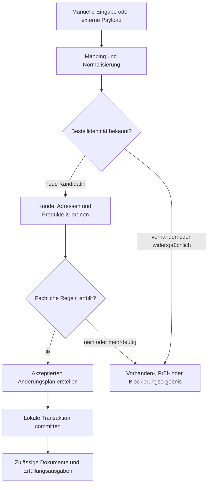

# Bestellablauf

Dieses Diagramm zeigt den öffentlichen MerchantFlow-Bestellprozess. Es stellt Entscheidungs- und Transaktionsgrenzen dar, ohne den vollständigen produktiven Zustandsautomaten offenzulegen.

## Lesart des Diagramms

- Manuelle und externe Eingangskanäle verwenden dieselbe interne Validierungsgrenze.
- Die Duplikatprüfung erfolgt vor Erstellung einer zweiten lokalen Transaktion.
- Kunden-, Adress- und Produktentscheidungen sind vor der Persistenz abgeschlossen.
- Ein strukturierter Plan trennt Validierung und Mutation.
- Dokumente und Versandausgaben folgen einer erfolgreichen lokalen Transaktion und eigenen Berechtigungsprüfungen.
- Prüf- und Blockierungsergebnisse hinterlassen keine teilweise akzeptierte Bestellung.

## Verwandte Dokumentation

- [Bestellablauf](../docs/06-order-workflow.de.md)
- [Kunden- und Adressversionierung](../docs/07-customer-address-versioning.de.md)
- [Domänenmodell](../docs/04-domain-model.de.md)
