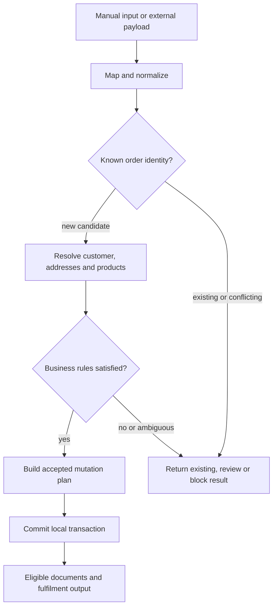

# Order Flow

This diagram shows the public MerchantFlow order-processing sequence. It presents decision and transaction boundaries without exposing the complete production state machine.

## Reading the Diagram

- Manual and external entry channels use the same internal validation boundary.
- Duplicate detection occurs before a second local transaction is created.
- Customer, address, and product decisions are completed before persistence.
- A structured plan separates validation from mutation.
- Documents and shipping output follow a successful local transaction and their own eligibility checks.
- Review and block results do not leave a partially accepted order.

## Related Documentation

- [Order Workflow](../docs/06-order-workflow.md)
- [Customer and Address Versioning](../docs/07-customer-address-versioning.md)
- [Domain Model](../docs/04-domain-model.md)
