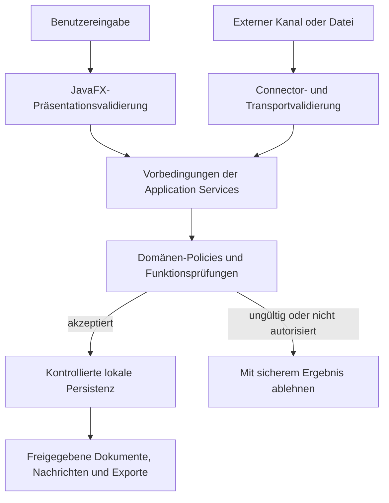

# Sicherheitsgrenzen

Dieses Diagramm zeigt den wesentlichen Vertrauens- und Validierungspfad. Produktive Topologie, Zugangsdaten, Anbieter und defensive Implementierungsdetails werden bewusst ausgelassen.

## Lesart des Diagramms

- Benutzer- und externe Eingaben bleiben bis zu den passenden Prüfungen nicht vertrauenswürdig.
- Transport-Parsing besitzt nicht die Domänenannahme.
- Anwendungs- und Domänengrenzen schützen Transaktionen und Funktionen.
- Nur akzeptierter Zustand erreicht lokale Persistenz und freigegebene Ausgaben.
- Abgelehnte Vorgänge liefern ein sicheres Ergebnis ohne Teilmutation.

## Verwandte Dokumentation

- [Sicherheit und Datenschutz](../docs/11-security-and-privacy.de.md)
- [Systemarchitektur](../docs/03-system-architecture.de.md)
- [Teststrategie](../docs/10-testing-strategy.de.md)
