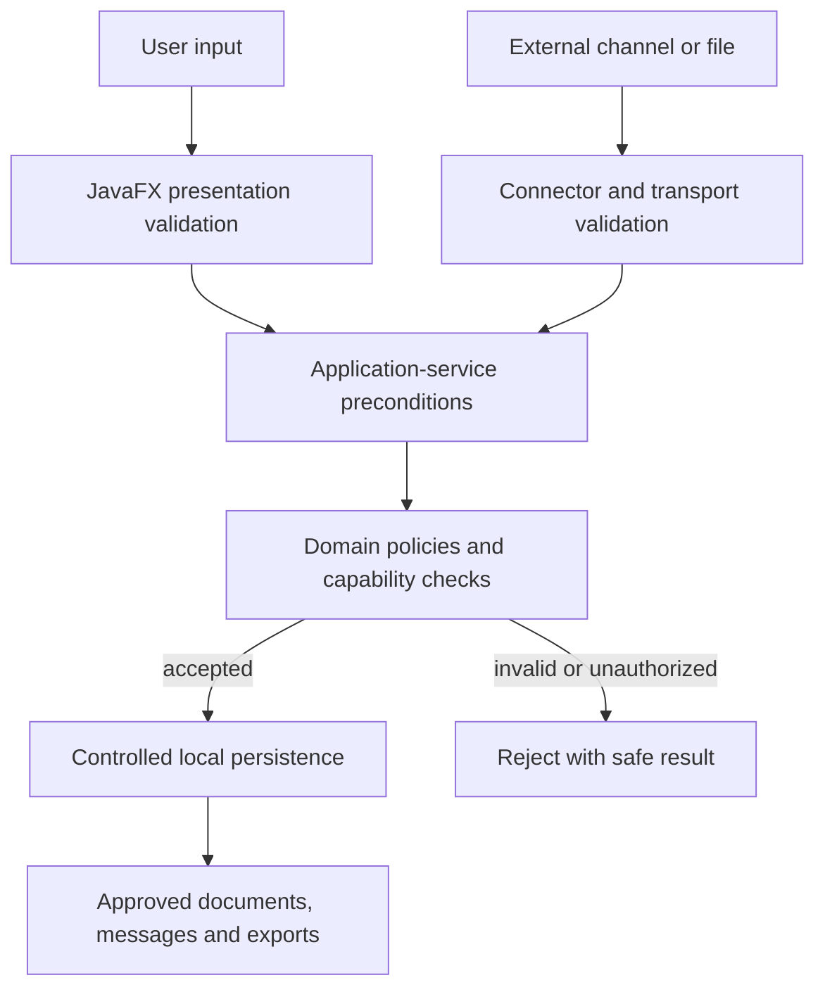

# Security Boundaries

This diagram shows the principal trust and validation path. It intentionally omits production topology, credentials, providers, and defensive implementation details.

## Reading the Diagram

- User and external input remain untrusted until the appropriate checks pass.
- Transport parsing does not own domain acceptance.
- Application and domain boundaries protect transactions and capabilities.
- Only accepted state reaches local persistence and approved output.
- Rejected operations return a safe result without partial mutation.

## Related Documentation

- [Security and Privacy](../docs/11-security-and-privacy.md)
- [System Architecture](../docs/03-system-architecture.md)
- [Testing Strategy](../docs/10-testing-strategy.md)
