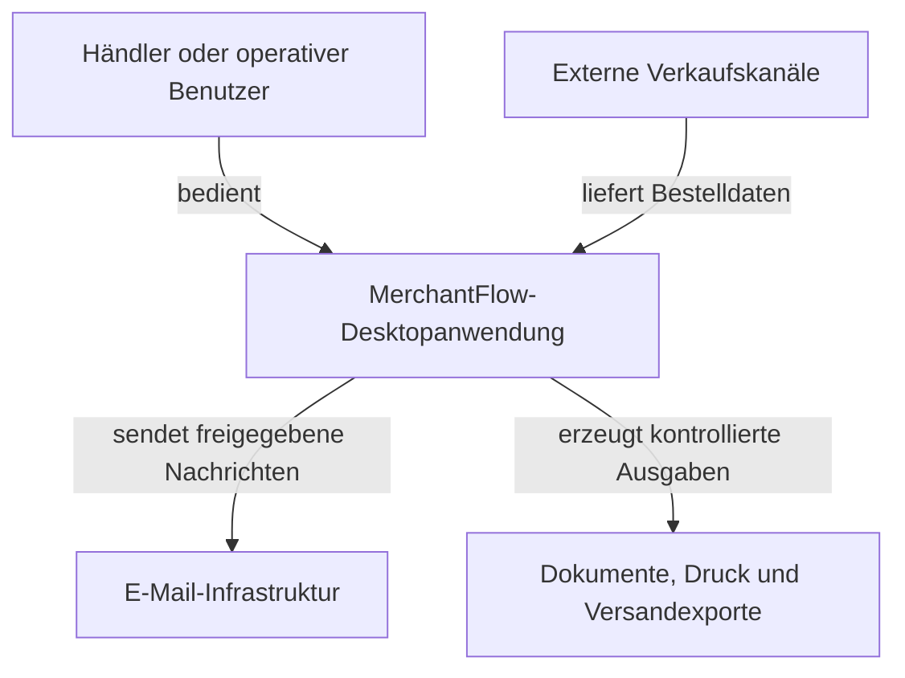

# Systemkontext

[English version](system-context.md)

## Kontextdiagramm

## Aussage des Diagramms

MerchantFlow führt die lokale Geschäftsakte für operative Handelsprozesse. Ein Händler oder operativer Benutzer arbeitet direkt mit der Desktopanwendung. Externe Verkaufskanäle können über kontrollierte Connectoren Bestelldaten bereitstellen. MerchantFlow validiert und akzeptiert diese Daten, bevor sie Bestandteil der lokalen Geschäftsakte werden.

Die Anwendung erzeugt freigegebene Nachrichten, Geschäftsdokumente, Druckaufträge und strukturierte Versandexporte. Externe Systeme erhalten keinen direkten Zugriff auf die lokale Datenbank.

## Akteure und Systeme

| Element | Beziehung zu MerchantFlow | Vertrauensgrenze |
| --- | --- | --- |
| Händler oder operativer Benutzer | Startet und prüft Geschäftsvorgänge | Benutzerabsichten durchlaufen weiterhin Anwendungs- und Domänenvalidierung |
| Externe Verkaufskanäle | Liefern transportspezifische Bestelldaten | Payloads gelten erst nach Mapping, Normalisierung und Validierung als vertrauenswürdig |
| E-Mail-Infrastruktur | Stellt von der Anwendung freigegebene Nachrichten zu | Transporterfolg ist vom Datenbankerfolg getrennt |
| Dokumente, Druck und Versandexporte | Erhalten erzeugte operative Ausgaben | Ausgaben entstehen nur aus einem akzeptierten Anwendungszustand |

## Datenrichtung

| Richtung | Beispielinformationen | Kontrolle |
| --- | --- | --- |
| Verkaufskanal → MerchantFlow | Bestellungen, Kundeneingaben, Adressen, Produkte, Zahlungs- und Versandmerkmale | Connector-Mapping, Normalisierung, Duplikatprüfung und Domänen-Policies |
| Benutzer → MerchantFlow | Korrekturen, Freigaben, Buchung, Stornierung, Konfiguration und Exportaufträge | UI-Validierung, Vorbedingungen, Funktionsprüfung und Transaktionen |
| MerchantFlow → E-Mail | Freigegebene Geschäftskommunikation und Dokumentanhänge | Application Service und konfigurierter Transportadapter |
| MerchantFlow → Ausgabe | PDFs, Druckaufträge, Tabellen und Carrier-kompatible Exportdateien | Geprüfte Bestelldaten, deterministische Formatierung und Duplikatschutz |

## Systemgrenze

Innerhalb der MerchantFlow-Grenze:

- Benutzerabläufe
- Application Services
- Domänen-Policies
- Lokale Persistenz
- Steuerung von Datenbankmigrationen
- Koordination von Dokumenten und Exporten
- Steuerung der Connectoren
- Bewertung von Funktionen und Lizenzen
- Diagnosen und Konfiguration

Außerhalb der MerchantFlow-Grenze:

- Betrieb von Onlineshops
- Physischer Versand
- Infrastruktur des E-Mail-Anbieters
- Abrechnung durch Zahlungsanbieter
- Offizielle Steuerübermittlung
- Externe Identitätsplattformen

## Bewusste Auslassungen

Das Kontextdiagramm veröffentlicht keine:

- echten Marketplaces, Domains oder Kontonamen
- Authentifizierungsverfahren oder Zugangsdaten
- produktiven Speicherpfade
- Datenbankstruktur
- Materialien zur Lizenzsignierung
- Kunden- oder Transaktionsdaten
- internen Schutzmechanismen gegen Manipulation

Das Diagramm vermittelt Systemverantwortung und Vertrauensgrenzen, ohne sensible Implementierungsdetails offenzulegen.
