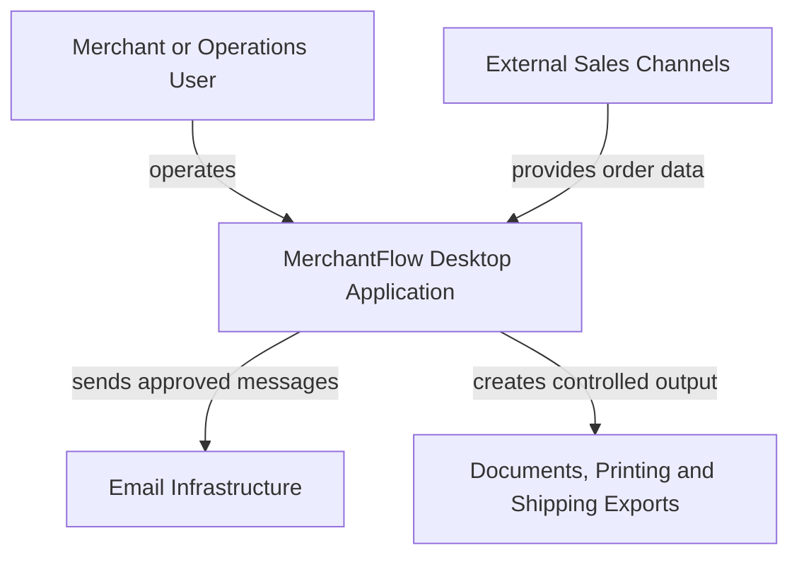

# System Context

[Deutsche Version](system-context.de.md)

## Context Diagram

## What the Diagram Shows

MerchantFlow is the local system of record for operational commerce workflows. A merchant or operations user works directly with the desktop application. External sales channels can provide order data through controlled connectors. MerchantFlow validates and accepts that data before it becomes part of the local business record.

The application produces approved messages, business documents, print jobs, and structured shipping exports. External systems do not receive direct access to the local database.

## Actors and Systems

| Element | Relationship to MerchantFlow | Trust boundary |
| --- | --- | --- |
| Merchant or operations user | Starts and reviews business operations | User intent still passes application and domain validation |
| External sales channels | Supply transport-specific order data | Payloads are untrusted until mapped, normalized, and validated |
| Email infrastructure | Delivers messages approved by the application | Transport success is separate from database success |
| Documents, printing, and shipping exports | Receive generated operational output | Output is created only from accepted application state |

## Data Direction

| Direction | Example information | Control |
| --- | --- | --- |
| Sales channel → MerchantFlow | Orders, customer input, addresses, products, payment and shipping attributes | Connector mapping, normalization, duplicate checks, and domain policies |
| User → MerchantFlow | Corrections, approvals, booking, cancellation, configuration, and export requests | UI validation, use-case preconditions, capability checks, and transactions |
| MerchantFlow → Email | Approved business communication and document attachments | Application service and configured transport adapter |
| MerchantFlow → Output | PDFs, print jobs, spreadsheets, and carrier-compatible export files | Validated order data, deterministic formatting, and duplicate protection |

## System Boundary

Inside the MerchantFlow boundary:

- User workflows
- Application services
- Domain policies
- Local persistence
- Database migration control
- Document and export orchestration
- Connector coordination
- Capability and license evaluation
- Diagnostics and configuration

Outside the MerchantFlow boundary:

- Operation of online storefronts
- Physical shipping
- Email-provider infrastructure
- Payment-provider settlement
- Official tax submission
- External identity platforms

## Deliberate Omissions

The context diagram does not expose:

- Real marketplaces, domains, or account names
- Authentication mechanisms or credentials
- Production storage paths
- Database structure
- License-signing material
- Customer or transaction data
- Internal anti-tampering mechanisms

The diagram communicates system responsibility and trust boundaries without revealing sensitive implementation details.
