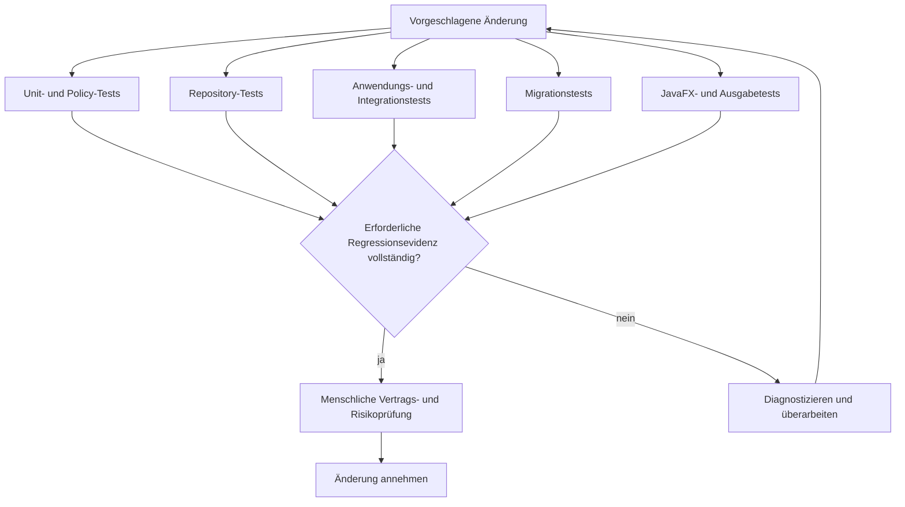

# Teststrategie

Dieses Diagramm zeigt, wie fokussierte Testebenen Nachweise für eine gemeinsame Regressions- und Prüfgrenze liefern.

## Lesart des Diagramms

- Unterschiedliche Risiken werden auf der kleinsten wirksamen Ebene geprüft.
- Migrations- und JavaFX-Prüfungen ergänzen Unit- und Servicetests.
- Erforderliche Nachweise laufen vor menschlicher Abnahme zusammen.
- Fehlgeschlagene oder instabile Ergebnisse führen zur Diagnose und werden nicht ignoriert.
- Menschliche Prüfung bestätigt, dass Tests sinnvolle Verträge darstellen.

## Verwandte Dokumentation

- [Teststrategie](../docs/10-testing-strategy.de.md)
- [CI/CD-Pipeline](../docs/09-ci-cd-pipeline.de.md)
- [Sicherheit und Datenschutz](../docs/11-security-and-privacy.de.md)
