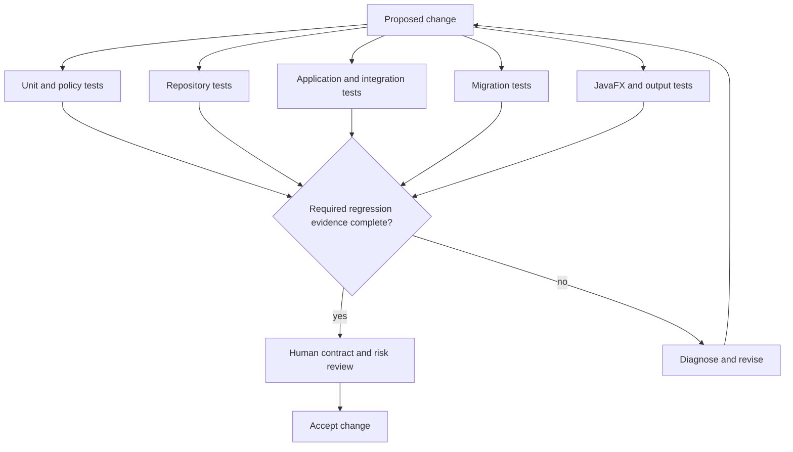

# Testing Strategy

This diagram shows how focused test layers provide evidence for one regression and review gate.

## Reading the Diagram

- Different risks are verified at the narrowest effective layer.
- Migration and JavaFX checks complement unit and service tests.
- Required evidence converges before human acceptance.
- Failed or unstable results return to diagnosis rather than being ignored.
- Human review confirms that tests represent meaningful contracts.

## Related Documentation

- [Testing Strategy](../docs/10-testing-strategy.md)
- [CI/CD Pipeline](../docs/09-ci-cd-pipeline.md)
- [Security and Privacy](../docs/11-security-and-privacy.md)
