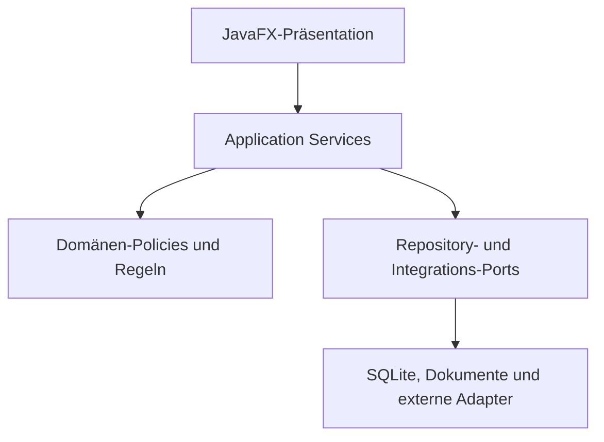

# Systemarchitektur

## 1. Zusammenfassung

MerchantFlow ist als Desktop-First-Anwendung und modularer Monolith aufgebaut. Die Anwendung läuft als ein auslieferbarer Java-Prozess, der eine JavaFX-Oberfläche mit Spring-verwalteten Application Services, Domänen-Policies, Repositories und Integrationsadaptern verbindet.

Die Architektur trennt Verantwortlichkeiten, ohne eine verteilte Systemkomplexität einzuführen, die das aktuelle Produkt nicht benötigt.

Dieses Dokument zeigt eine konzeptionelle Architektur. Produktive Package-Namen, Datenbankdefinitionen, Connector-Endpunkte, Zugangsdaten und Schutzdetails werden bewusst nicht veröffentlicht.

## 2. Architekturziele

Die Architektur soll Folgendes gewährleisten:

- Klare Trennung von Präsentation, Anwendungsfällen, Domänenentscheidungen und Infrastruktur
- Transaktionale Konsistenz lokaler Geschäftsvorgänge
- Schutz historischer Bestellungen und Dokumente
- Kontrollierte Anbindung externer Systeme
- Austauschbare Infrastrukturadapter
- Testbare Geschäftsregeln und Fehlerverhalten
- Sichere Datenbankentwicklung
- Zentrale Bewertung von Funktionen und Lizenzen
- Verständliche Diagnosen und betriebliche Konfiguration
- Schrittweise Weiterentwicklung ohne vorschnelle Verteilung

## 3. Schichtenmodell

Die Pfeile zeigen auf konzeptioneller Ebene die erlaubte Orchestrierung und Nutzung von Abhängigkeiten. Domänenentscheidungen dürfen nicht von JavaFX-Controls, SQL-Details, HTTP-Payloads oder Bibliotheken zur Dokumentdarstellung abhängen.

## 4. Verantwortlichkeiten der Schichten

### 4.1 JavaFX-Präsentation

Die Präsentationsschicht stellt Fenster, Dialoge, Tabellen, Formulare, Navigation, Benutzerfeedback und View-State-Koordination bereit.

Ihre Verantwortlichkeiten sind begrenzt auf:

- Darstellung von Anwendungsdaten
- Erfassung der Benutzerabsicht
- Präsentationsbezogene Validierung
- Aufruf von Anwendungsfällen
- Darstellung von Erfolg, Warnung und Fehler

Die Oberfläche entscheidet nicht, ob zwei Kunden identisch sind, ob eine historische Adresse geändert werden darf, ob eine Bestellung gebucht werden kann oder ob eine lizenzierte Funktion verfügbar ist.

### 4.2 Application Services

Application Services setzen Anwendungsfälle um und koordinieren die Arbeit über Domänen- und Infrastrukturgrenzen hinweg.

Typische Verantwortlichkeiten sind:

- Festlegung von Transaktionsgrenzen
- Laden benötigter Datensätze
- Aufruf von Domänen-Policies
- Koordination von Repositories und Adaptern
- Durchsetzung anwendungsbezogener Vorbedingungen
- Rückgabe strukturierter Ergebnisse an die Oberfläche
- Vermeidung teilweise übernommener Änderungen

Application Services kennen die Reihenfolge eines Vorgangs, delegieren einzelne Geschäftsentscheidungen aber an explizite Regeln oder Policies.

### 4.3 Domänen-Policies und Regeln

Die Domänenschicht enthält die fachliche Bedeutung und die Invarianten. Sie soll ohne laufende JavaFX-Oberfläche und ohne aktiven externen Connector testbar sein.

Beispiele für Domänenaufgaben sind:

- Nachweise zur Kundenidentität
- Eigentum und Versionierung von Adressen
- Statusübergänge einer Bestellung
- Steuer- und Preisverhalten
- Berechtigung zur Dokumenterstellung
- Duplikatvermeidung
- Funktionsbewertung
- Fail-closed-Entscheidungen

Policies sollen explizite Ergebnisse liefern, beispielsweise akzeptieren, neue Version erstellen, bestehende Bindung erhalten oder Vorgang blockieren. Mehrdeutigkeit darf nicht still in eine erfolgreiche Entscheidung umgewandelt werden.

### 4.4 Repository- und Integrations-Ports

Ports beschreiben, was die Anwendung von der Persistenz und von externen Systemen benötigt, ohne Transport- oder Speicherdetails in die Domäne zu tragen.

Beispiele sind:

- Kunden- und Adress-Repositories
- Bestell- und Produkt-Repositories
- Zugriff auf Einstellungen und Lizenzstatus
- Verträge für Marketplace-Connectoren
- Dokument- und Druckservices
- Versandexport-Services
- Adapter für E-Mail-Zustellung

Ports ermöglichen kontrollierte Testimplementierungen und verhindern, dass externe Formate in der gesamten Anwendung verbreitet werden.

### 4.5 Infrastrukturadapter

Infrastrukturadapter setzen technische Aufgaben um:

- SQLite-Persistenz über JPA-Repositories
- Flyway-Datenbankmigrationen
- HTTP-Kommunikation mit externen Kanälen
- PDF- und Tabellenerstellung
- Druck und Dateisystemzugriff
- E-Mail-Transport
- Laufzeitdiagnosen und Speicherpfadauflösung

Adapter übersetzen zwischen technischen Darstellungen und internen Verträgen. Sie dürfen die Domänenvalidierung nicht umgehen.

## 5. Modulare Struktur

Die Anwendung ist ein gemeinsam auslieferbarer Prozess, enthält aber getrennte Funktionsmodule.

| Modul | Hauptverantwortung | Wichtige Grenze |
| --- | --- | --- |
| Kunden und Adressen | Identität, Kontaktdaten, Herkunft, Adressversionen und Aktivitätsstatus | Historische Bestelldaten dürfen nicht durch Stammdatenänderungen überschrieben werden |
| Produkte | Kaufmännische, steuerliche, Herkunfts-, Gewichts- und Versandstammdaten | Unvollständige Betriebsdaten müssen vor abhängigen Prozessen sichtbar werden |
| Bestellungen | Manuelle und externe Verarbeitung, Validierung, Lebenszyklus und Buchung | Statusübergänge müssen explizite Voraussetzungen erfüllen |
| Dokumente | Rechnungen, Lieferscheine, Stornierungen, Druck und Speicherung | Dokumente verwenden zuordenbare historische Bestelldaten |
| Versand | Tagesvorbereitung, Carrier-Formate, Validierung und Duplikatschutz | Exporte werden vor der Übergabe deterministisch erstellt und geprüft |
| Buchhaltung | Bücher, Übersichten, Produktmengen, steuerbezogene Ansichten und Exporte | Auswertungen entstehen aus akzeptierten Geschäftsvorgängen |
| Integrationen | Marketplace-Abruf, Transport-Mapping, Normalisierung und Synchronisierung | Externe Payloads werden erst nach lokaler Akzeptanz verbindlich |
| Lizenzierung | Edition, Funktionen, Betriebsmodus und Fail-closed-Bewertung | Geschützte Funktionen werden zentral bewertet |
| Konfiguration und Diagnosen | Unternehmen, Steuern, Dokumente, E-Mail, Speicher, Sicherung, Sprache und Laufzeitinformationen | Sensible Werte werden nicht unnötig offengelegt |

Modulgrenzen sind logische Verantwortungsgrenzen. Sie bedeuten keine getrennt auslieferbaren Services.

## 6. Typischer Ablauf eines Anwendungsfalls

Viele Geschäftsvorgänge folgen dieser Reihenfolge:

1. Ein Benutzer führt eine Aktion in der JavaFX-Oberfläche aus.
2. Die Oberfläche erstellt oder aktualisiert ein Anwendungs-Request-Objekt.
3. Ein Application Service prüft Vorbedingungen und lädt den benötigten Zustand.
4. Domänen-Policies bewerten die Geschäftsentscheidung.
5. Bei einer Blockierung wird keine Geschäftsänderung committed.
6. Bei Annahme führen Repositories und Adapter den freigegebenen Plan innerhalb der erforderlichen Transaktionsgrenze aus.
7. Der Service liefert ein strukturiertes Ergebnis zurück.
8. Die Oberfläche aktualisiert ihren Zustand und zeigt das Ergebnis an.

Dieser Ansatz aus Planung vor Ausführung ist besonders wichtig bei Änderungen an Kundenidentität, Adresshistorie, Bestellbindungen, Dokumenten oder lizenzgeschützten Zuständen.

## 7. Transaktions- und Konsistenzgrenzen

Transaktionen gehören zu Anwendungsfällen und nicht zu einzelnen UI-Ereignissen oder niedrigstufigen Repository-Aufrufen.

Die wichtigsten Grundsätze sind:

- Alle für die Geschäftsentscheidung erforderlichen Nachweise lesen.
- Entscheidung vor dem Schreiben bewerten.
- Zusammengehörige Änderungen bei Bedarf in einer kontrollierten Transaktion ausführen.
- Mehrdeutige oder ungültige Pläne vor der Mutation ablehnen.
- Versteckte Schreibvorgänge aus Mapping- oder Rendering-Code vermeiden.
- Explizite Fehler zurückgeben, statt einen Teilzustand zu hinterlassen.

Externe Nebeneffekte wie Druck, Dateierstellung, E-Mail oder entfernte API-Aufrufe benötigen eine bewusste Reihenfolge, weil sie nicht immer Bestandteil einer Datenbanktransaktion sein können.

## 8. Schutz historischer Daten

MerchantFlow unterscheidet zwischen aktuellen Stammdaten und historischen Transaktionsdaten.

Beispiel:

- Ein Kunde zieht an eine neue Adresse.
- Zukünftige Bestellungen können die neue Adresse verwenden.
- Eine bereits gebuchte Bestellung muss weiterhin auf die damals verwendete Adresse verweisen.
- Eine Korrektur muss einer expliziten Versionierungs- oder Ersetzungsregel folgen.

Diese Trennung unterstützt Nachvollziehbarkeit, Dokumentkonsistenz und sichere Synchronisierung mit externen Quellen.

## 9. Grenze zu externen Systemen

Externe Kanäle kommunizieren über Adapter. Eine Marketplace-spezifische Payload wird niemals direkt als Domänenobjekt behandelt.

Die Adaptergrenze übernimmt:

- Authentifizierung und Transport
- Parsing der Payload
- Feldzuordnung
- Übersetzung technischer Fehler
- Einordnung von Wiederholung und Fehler, soweit erforderlich

Anwendungs- und Domänenschicht übernehmen:

- Normalisierung
- Identitäts- und Duplikatentscheidungen
- Adress- und Produktvalidierung
- Entscheidungen über Statusübergänge
- Planung der Persistenz

Diese Trennung verhindert, dass transportspezifische Annahmen die lokale Geschäftsakte kontrollieren.

## 10. Funktions- und Lizenzgrenze

Entscheidungen zu Edition und Lizenz werden zentral als Funktionen bewertet. Sichtbarkeit in der Oberfläche und Autorisierung im Service müssen dasselbe Ergebnis verwenden.

Ein deaktivierter Button allein ist kein Architekturschutz. Auch der Application Service muss einen Vorgang ablehnen, wenn die erforderliche Funktion nicht verfügbar ist.

Unsichere oder ungültige sicherheitsrelevante Zustände folgen dem Fail-closed-Prinzip. Detailliertes Signaturmaterial und Schutzmechanismen bleiben außerhalb dieser öffentlichen Fallstudie.

## 11. Querschnittsaufgaben

### Validierung

Validierung erfolgt an der passenden Grenze: Präsentationsformatierung in der Oberfläche, Vorbedingungen in Application Services und fachliche Invarianten in Domänen-Policies.

### Internationalisierung

Benutzertexte und Meldungen werden über eine kontrollierte Internationalisierungsgrenze aufgelöst und nicht als unstrukturierte Literale in der Geschäftslogik verteilt.

### Diagnosen

Diagnosen machen Laufzeitmodus, Speicherauswahl, Migrationsstand und Betriebszustand verständlich, ohne Secrets oder unnötige personenbezogene Daten offenzulegen.

### Auditierung

Wichtige Datensätze können Metadaten zu Erstellung, Aktualisierung, Quelle und Version tragen. Auditinformationen unterstützen die Nachvollziehbarkeit, ersetzen aber keine Domänenvalidierung.

### Fehlerbehandlung

Technische Exceptions werden in strukturierte Anwendungsfehler übersetzt. Benutzer sollen handlungsfähige Meldungen erhalten, während sensible interne Details geschützt bleiben.

## 12. Auswirkungen auf Tests

Die Schichtenarchitektur ermöglicht fokussierte Tests:

- UI-Tests prüfen Interaktion und Präsentationsverhalten.
- Application-Service-Tests prüfen Orchestrierung und Transaktionsergebnisse.
- Policy-Tests prüfen Entscheidungstabellen und Grenzfälle.
- Repository-Tests prüfen Persistenzverträge.
- Migrationstests prüfen Upgrades bestehender Datenbanken.
- Connector-Tests prüfen Mapping- und Fehlergrenzen.
- Regressionssuiten verhindern die Rückkehr bekannter Fehler.

Die wichtigsten Geschäftsregeln müssen ohne Start der vollständigen Desktopoberfläche testbar sein.

## 13. Bewusste Nicht-Ziele

Die aktuelle Architektur verfolgt nicht:

- Unabhängig auslieferbare Microservices
- Direkten externen Zugriff auf die lokale Datenbank
- Browserbasierte Verwaltung der vollständigen Geschäftsakte
- Unbegrenzte gleichzeitige Schreibzugriffe über mehrere Knoten
- Domänenentscheidungen innerhalb von Connector-Payload-Mappern
- Sicherheit allein durch das Verbergen von UI-Elementen

Diese Nicht-Ziele reduzieren unnötige Komplexität und schützen das Betriebsmodell des Desktopprodukts.

## 14. Verwandte Dokumentation

- [Produktübersicht](01-product-overview.de.md)
- [Technologiestack](02-technology-stack.de.md)
- [Systemkontextdiagramm](../diagrams/system-context.de.md)
- [Veröffentlichungsgrenzen](../PUBLICATION-SCOPE.de.md)
