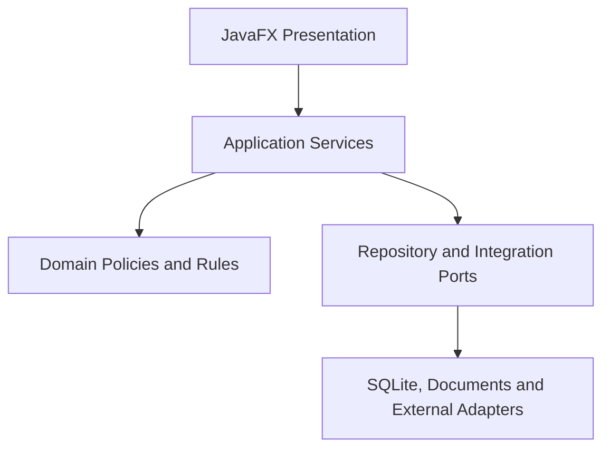

# System Architecture

## 1. Architecture Summary

MerchantFlow is designed as a desktop-first modular monolith. The application runs as one deployable Java process that combines a JavaFX user interface with Spring-managed application services, domain policies, repositories, and integration adapters.

The architecture separates responsibilities without introducing distributed-system complexity that the current product does not require.

This document presents a conceptual architecture. It intentionally avoids production package names, database definitions, connector endpoints, credentials, and anti-tampering details.

## 2. Architecture Goals

The architecture is intended to provide:

- Clear separation between presentation, use cases, domain decisions, and infrastructure
- Transactional consistency for local business operations
- Protection of historical orders and documents
- Controlled integration with external systems
- Replaceable infrastructure adapters
- Testable business rules and failure behavior
- Safe database evolution
- Central capability and license evaluation
- Understandable diagnostics and operational configuration
- Incremental growth without premature distribution

## 3. Layered View

The arrows show allowed orchestration and dependency use at a conceptual level. Domain decisions must not depend on JavaFX controls, SQL details, HTTP payloads, or document-rendering libraries.

## 4. Layer Responsibilities

### 4.1 JavaFX presentation

The presentation layer provides windows, dialogs, tables, forms, navigation, user feedback, and view-state coordination.

Its responsibilities are limited to:

- Displaying application data
- Capturing user intent
- Performing presentation-level validation
- Calling application use cases
- Presenting success, warning, and failure results

The UI must not decide whether two customers are identical, whether an historical address may be changed, whether an order may be booked, or whether a licensed capability is available.

### 4.2 Application services

Application services implement use cases and coordinate work across the domain and infrastructure boundaries.

Typical responsibilities include:

- Establishing transaction boundaries
- Loading required records
- Calling domain policies
- Coordinating repositories and adapters
- Enforcing application-level preconditions
- Returning structured outcomes to the UI
- Preventing partially applied operations

Application services know the sequence of an operation but delegate individual business decisions to explicit rules or policies.

### 4.3 Domain policies and rules

The domain layer contains business meaning and invariants. It is designed to be testable without a running JavaFX interface or a live external connector.

Examples of domain concerns are:

- Customer identity evidence
- Address ownership and versioning
- Order lifecycle transitions
- Tax and price behavior
- Document eligibility
- Duplicate prevention
- Capability evaluation
- Fail-closed decisions

Policies should produce explicit results such as accept, create a new version, keep an existing binding, or block the operation. Ambiguity is not converted silently into a successful decision.

### 4.4 Repository and integration ports

Ports define what the application needs from persistence and external systems without exposing transport or storage details to the domain.

Examples include:

- Customer and address repositories
- Order and product repositories
- Settings and license access
- Marketplace connector contracts
- Document and print services
- Shipping-export services
- Email delivery adapters

Ports allow tests to replace infrastructure with controlled implementations and prevent external formats from spreading through the application.

### 4.5 Infrastructure adapters

Infrastructure adapters implement technical concerns:

- SQLite persistence through JPA repositories
- Flyway database migrations
- HTTP communication with external channels
- PDF and spreadsheet generation
- Printing and file-system interaction
- Email transport
- Runtime diagnostics and storage resolution

Adapters translate between technical representations and internal contracts. They must not bypass domain validation.

## 5. Modular Structure

The application is one deployable process but contains distinct functional modules.

| Module | Main responsibility | Important boundary |
| --- | --- | --- |
| Customers and addresses | Identity, contact data, origins, address versions, and activity state | Historical order data must not be overwritten by master-data edits |
| Products | Commercial, tax, origin, weight, and shipping-related master data | Incomplete operational data must be surfaced before dependent workflows |
| Orders | Manual and external order processing, validation, lifecycle, and booking | State transitions must satisfy explicit preconditions |
| Documents | Invoices, delivery notes, cancellations, printing, and storage | Documents use attributable historical order data |
| Shipping | Daily preparation, carrier formats, validation, and duplicate protection | Exports are deterministic and validated before delivery |
| Accounting | Registers, summaries, product quantities, tax-oriented views, and exports | Reports derive from accepted business transactions |
| Integrations | Marketplace retrieval, transport mapping, normalization, and synchronization | External payloads are not authoritative until locally accepted |
| Licensing | Edition, capability, operational mode, and fail-closed evaluation | Protected capabilities are evaluated centrally |
| Configuration and diagnostics | Company, tax, documents, email, storage, backup, language, and runtime information | Sensitive values are not exposed unnecessarily |

Module boundaries are logical ownership boundaries. They do not imply separately deployed services.

## 6. Typical Use-Case Flow

The following sequence applies to many business operations:

1. A user performs an action in the JavaFX UI.
2. The UI creates or updates an application request object.
3. An application service validates preconditions and loads required state.
4. Domain policies evaluate the business decision.
5. If the result is blocked, no business mutation is committed.
6. If accepted, repositories and adapters execute the approved plan within the required transaction boundary.
7. The service returns a structured result.
8. The UI refreshes its state and presents the outcome.

This plan-before-execution approach is especially important for operations that could change customer identity, address history, order bindings, documents, or license-protected state.

## 7. Transaction and Consistency Boundaries

Transactions are owned by application use cases rather than individual UI events or low-level repository calls.

The key principles are:

- Read all evidence required for a business decision.
- Evaluate the decision before writing.
- Apply related changes within one controlled transaction where appropriate.
- Reject ambiguous or invalid plans before mutation.
- Avoid hidden writes from mapping or rendering code.
- Return explicit failure information instead of leaving partial state.

External side effects such as printing, file creation, email, or remote API calls require deliberate ordering because they cannot always participate in a database transaction.

## 8. Historical Data Protection

MerchantFlow distinguishes between current master data and historical transaction data.

For example:

- A customer may move to a new address.
- Future orders may use the new address.
- An existing booked order must continue to reference the address used for that transaction.
- A correction must follow an explicit versioning or replacement policy.

This separation supports traceability, document consistency, and safe synchronization with external sources.

## 9. External System Boundary

External channels communicate through adapters. A marketplace-specific payload is never treated as a domain object directly.

The adapter boundary performs:

- Authentication and transport handling
- Payload parsing
- Field mapping
- Technical error conversion
- Retry or failure classification where appropriate

The application and domain layers perform:

- Normalization
- Identity and duplicate decisions
- Address and product validation
- State-transition decisions
- Persistence planning

This division prevents transport-specific assumptions from controlling the local business record.

## 10. Capability and License Boundary

Edition and license decisions are centralized as capabilities. UI visibility and service authorization must use the same evaluation result.

A disabled button alone is not an architectural protection. The application service must also reject an operation when the required capability is unavailable.

Uncertain or invalid security-relevant states follow a fail-closed policy. Detailed signing material and protection mechanisms remain outside this public case study.

## 11. Cross-Cutting Concerns

### Validation

Validation occurs at the appropriate boundary: presentation formatting in the UI, use-case preconditions in application services, and business invariants in domain policies.

### Internationalization

User-facing labels and messages are resolved through a controlled internationalization boundary instead of being distributed as unstructured literals across business logic.

### Diagnostics

Diagnostics make runtime mode, storage selection, migration state, and operational health understandable without revealing secrets or unnecessary personal data.

### Auditing

Important records can carry creation, update, source, and version metadata. Audit information supports traceability but does not replace domain validation.

### Error handling

Technical exceptions are translated into structured application failures. Users should receive actionable messages while sensitive internal details remain protected.

## 12. Testing Consequences

The layered design enables focused tests:

- UI tests verify interaction and presentation behavior.
- Application-service tests verify orchestration and transaction outcomes.
- Policy tests verify decision tables and edge cases.
- Repository tests verify persistence contracts.
- Migration tests verify existing database upgrades.
- Connector tests verify mapping and error boundaries.
- Regression suites verify that changes do not reopen known failures.

The most important business rules should be testable without starting the complete desktop interface.

## 13. Deliberate Non-Goals

The current architecture does not attempt to provide:

- Independently deployed microservices
- Direct external access to the local database
- Browser-based administration of the complete business record
- Unrestricted concurrent multi-node writes
- Domain decisions inside connector payload mappers
- Security based only on hiding UI elements

These non-goals reduce accidental complexity and protect the operating model of the desktop product.

## 14. Related Documentation

- [Product Overview](01-product-overview.md)
- [Technology Stack](02-technology-stack.md)
- [System Context Diagram](../diagrams/system-context.md)
- [Publication Scope](../PUBLICATION-SCOPE.md)
